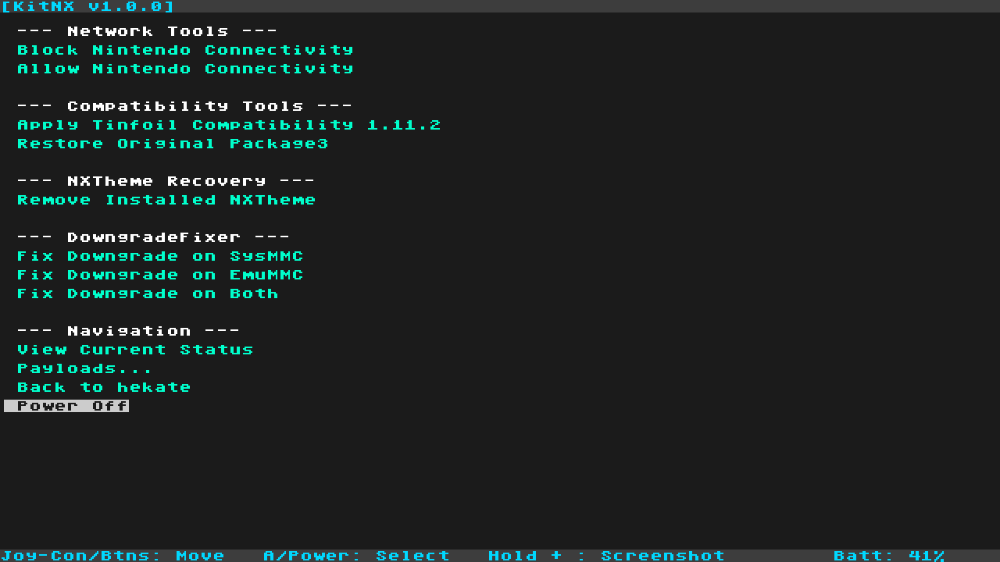

# KitNX

<p align="center">
  
</p>

**An all-in-one bare-metal maintenance and recovery payload for Nintendo Switch.**

KitNX combines commonly needed maintenance and recovery tools in one guided interface, avoiding the extra step of opening TegraExplorer and selecting a script.

## Features

### Network Tools

- Block Nintendo connectivity on sysMMC.
- Allow Nintendo connectivity on sysMMC.
- Display the current network and compatibility configuration.

### Compatibility Tools

- Apply the bundled Tinfoil-compatible Atmosphere `package3`.
- Back up and restore the original `package3` and boot logos.

### Maintenance and Recovery

- Remove the installed qlaunch theme override at `atmosphere/contents/0100000000001000`.
- Repair the downgrade state on SysMMC, emuMMC, or both by deriving BIS keys and removing `SYSTEM/save/8000000000000073`.

## Safety

KitNX separates SD-card maintenance from NAND operations:

- Network, compatibility, and theme tools modify files on the SD card.
- Downgrade recovery mounts the encrypted NAND SYSTEM partition and deletes one exact save file.
- Destructive operations require an explicit VOL+ confirmation.
- The downgrade menu disables emuMMC targets when no emuMMC configuration is detected.

Keep NAND and SD-card backups. Allowing sysMMC network access does not remove ban risk.

## Installation

1. Copy `KitNX.bin` to `bootloader/payloads/` on the SD card.
2. Launch Hekate and open **Payloads**.
3. Select `KitNX.bin`.
4. Navigate with Volume Up / Volume Down and confirm with Power.

## Compatibility Data

Tinfoil compatibility files are stored under `config/kitnx/tce/`. Existing backups under `config/netman/tce/backup/` remain available as a restore fallback.

## Building from Source

Set up devkitPro/devkitARM, then run:

```bash
make
```

The build creates the KitNX payload and release ZIP under `output/`. The ZIP includes the payload and the bundled `package3` under `config/kitnx/tce/`.

## License

KitNX is licensed under the GNU General Public License v2.0. See [LICENSE](LICENSE).

## Credits

- NetMan network and Tinfoil compatibility functionality.
- DowngradeFixer NAND recovery functionality.
- Lockpick_RCM_Pro and Lockpick_RCMaster key-derivation foundations.
- hekate bootloader libraries.
- hactool save processing components, licensed under ISC.

## Support

Report bugs or request improvements through the KitNX GitHub repository.

## Support My Work

If you find this project useful, please consider supporting me by buying me a coffee!

<a href="https://www.buymeacoffee.com/sthetixofficial" target="_blank">
  
</a>
